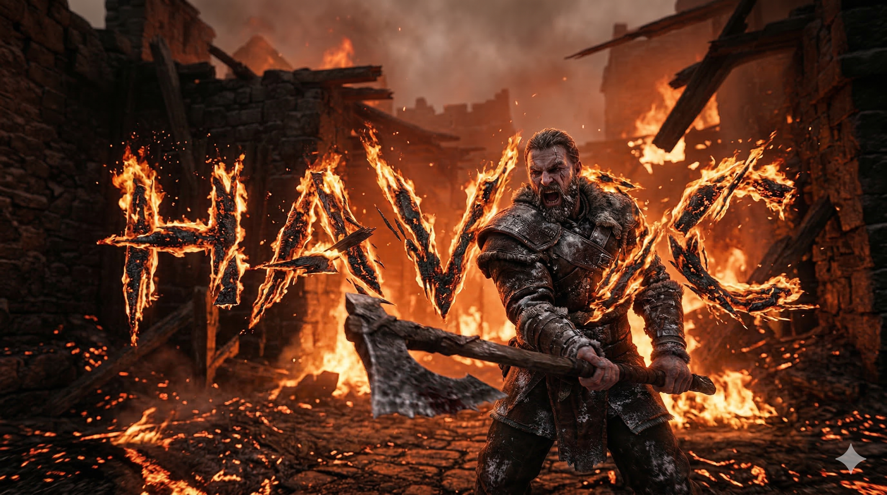
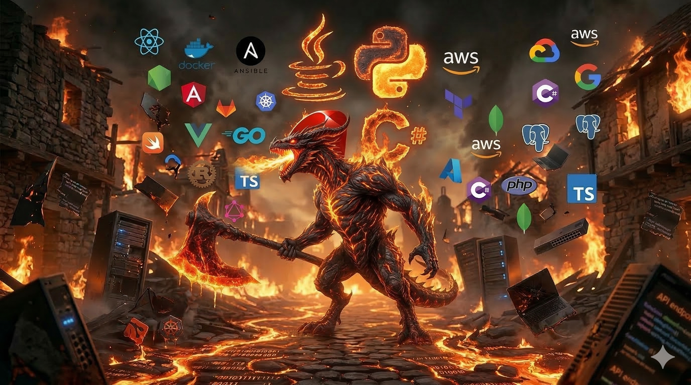

<div align="center">




[](https://git.io/typing-svg)

[](https://anshyadav.tech)
[](https://www.linkedin.com/in/ansh-yadav-79a20132b/)
[](mailto:bytenashrao@gmail.com)

</div>

---

## Core Signal

I build cinematic digital experiences where **motion + depth + intelligence** work as one system.

- Spatial web interfaces with Spline/Three.js pipelines
- Product-grade frontends with animation architecture
- AI-assisted workflows for speed, quality, and iteration
- Security-aware engineering mindset from prototype to deploy

---

## Animated Tech Stack

<div align="center">


</div>

<p align="center">
	
	
	
	
	
</p>

---

## Feature Builds

### FlowPulse
Flagship 3D portfolio experience with story-driven interactions, cinematic transitions, and custom scene logic.

- Live: [anshyadav.tech](https://anshyadav.tech)
- Focus: interactive storytelling, spatial navigation, polished performance

### School Website Platform
Education-first platform modernization with scalable UX patterns and immersive visual identity.

- Live: [dpsaring.in](https://dpsaring.in)
- Focus: accessibility, performance, maintainable design system

---

## Dragon Zone

<div align="center">
	
</div>

---

## Live GitHub Pulse

<div align="center">
	
	
</div>

<div align="center">
	
</div>

---

## Build Philosophy

```txt
Design for emotion.
Engineer for scale.
Ship for impact.
```

<div align="center">

</div>
